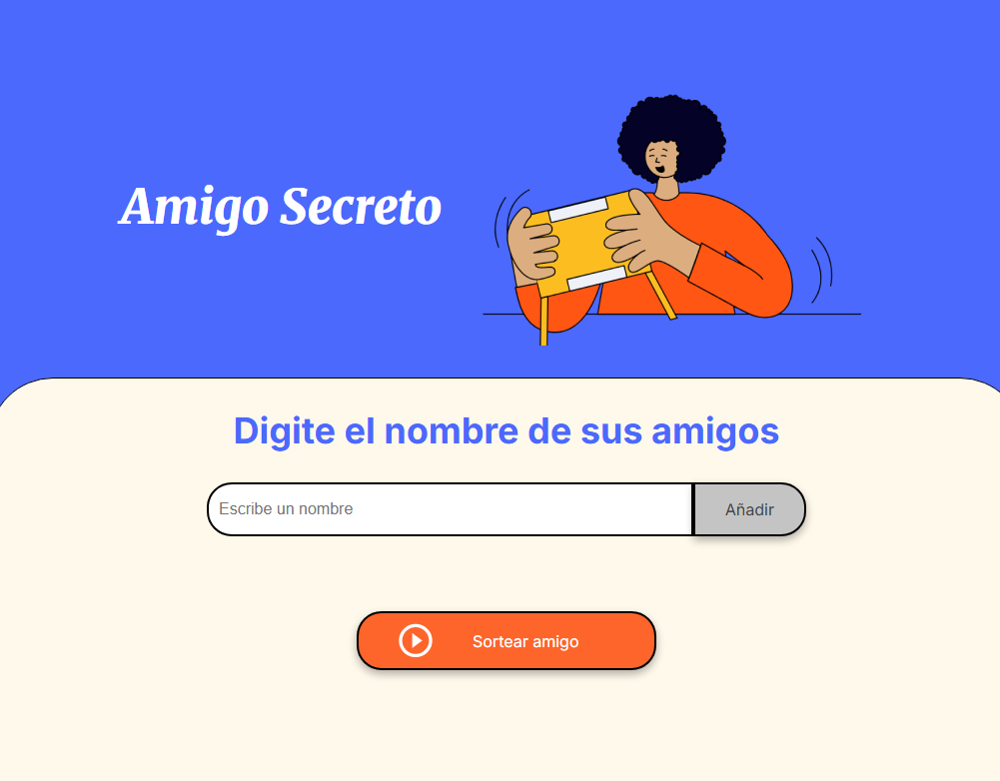

## <h1>  Primer Desafío 👩‍💻  - "Amigo Secreto" 🧑‍🤝‍🧑 </h1> 

;

## <h1> Acerca del proyecto 💻 </h1> 

Es parte del curso "Lógica de programación" donde se pretende practicar y reforzar conceptos fundamentales como: funciones, bucles, condicionales, arrays, entre otras herramientas. Lo más importante desarrollar esa parte de lógica y resolución de problemas.

- Estado del proyecto: En desarrollo.

## <h1> Objetivo del Challenge 🎯 </h1> 
Desarrollar una aplicación donde el usuario interactue:
- Agregando nombres a una lista que se pueda observar.
- Los datos agregados se validen: que no esté vacío y no esten duplicados.
- Se pueda sortear un nombre de manera aleatoria que esté en la lista.
- Se muestre el resultado en pantalla.
- Se reinicie la lista al final.

## <h1> Funcionalidades Implementadas ✅ </h1> 
- Agregar nombres y validarlos.
- Evitar entradas vacías o repetidas.
- Visualizar cada nombre agregado en una lista.
- Sortear aleatoriamente un nombre.
- Mostrar el nombre sorteado.
- Limpiar el campo de entrada.
- Reiniciar la lista al terminar el sorteo.

