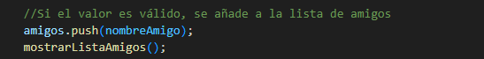
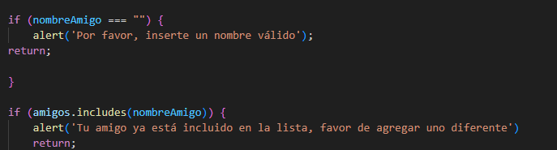
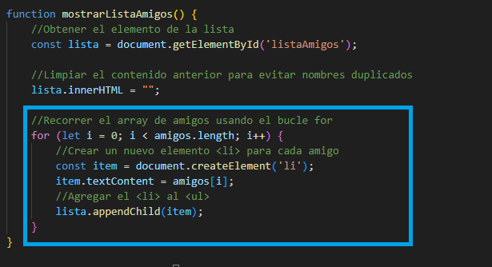
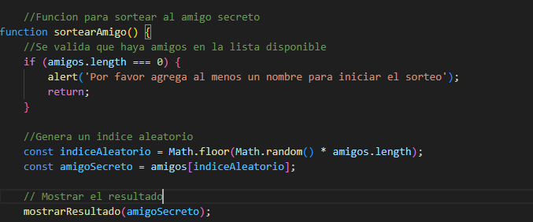
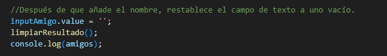
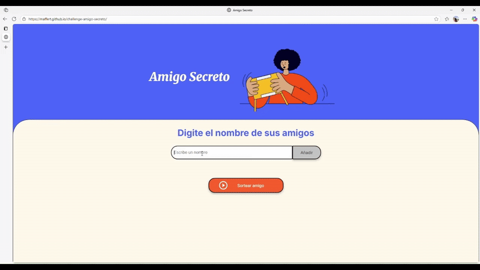

## <h1>  Primer Desafío 👩‍💻  - "Amigo Secreto" 🧑‍🤝‍🧑 </h1> 

## <h1> Acerca del proyecto 💻 </h1> 

Es parte del curso "Lógica de programación" donde se pretende practicar y reforzar conceptos fundamentales como: funciones, bucles, condicionales, arrays, entre otras herramientas. Lo más importante desarrollar esa parte de lógica y resolución de problemas.

## <h1> Objetivo del Challenge 🎯 </h1> 
Desarrollar una aplicación donde el usuario interactue:
- Agregando nombres a una lista que se pueda observar.
- Los datos agregados se validen: que no esté vacío y no esten duplicados.
- Se pueda sortear un nombre de manera aleatoria que esté en la lista.
- Se muestre el resultado en pantalla.
- Se reinicie la lista al final.

## <h1> Tecnologías utilizadas 💻 </h1> 
- 🟧 HTML
- 🎨 CSS
- ⚙️ JavaScript

## <h1> Funcionalidades Implementadas ✅ </h1> 

<table>
  <tr>
    <td>Agregar nombres a la lista 📝 ➕ </td>
    <td></td>
  </tr>
    <tr>
    <td>Validar entrada ⚠️ </td>
    <td></td>
  </tr>
   <tr>
    <td>Visualizar Lista 📄 </td>
    <td></td>
  </tr>
   </tr>
   <tr>
    <td>Sortear Nombre Aleatorio 🎲 </td>
    <td></td>
  </tr>
  <tr>
    <td>Limpiar Campo de entrada 🔄 </td>
    <td></td>
  </tr>
</table>

## <h1> Muestra 🎥 </h1>

  👩‍💻 Autor : Fernanda Torres

  📎 GitHub: https://github.com/Maffert

  🔗 Enlace: https://maffert.github.io/challenge-amigo-secreto/

